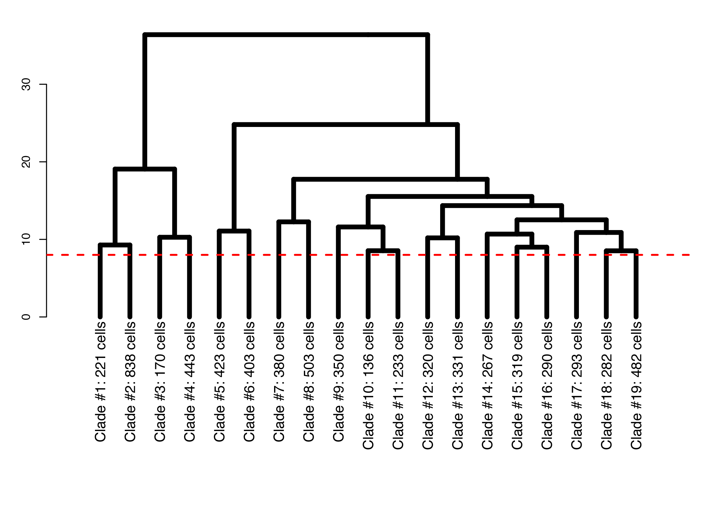
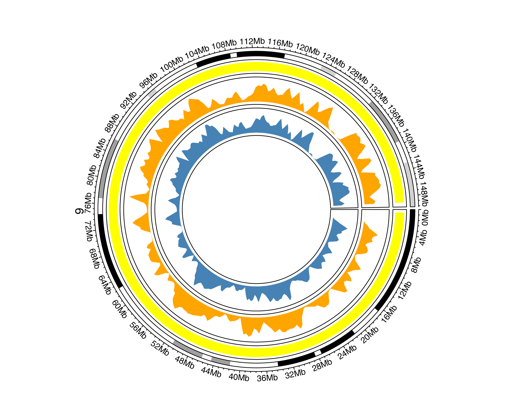
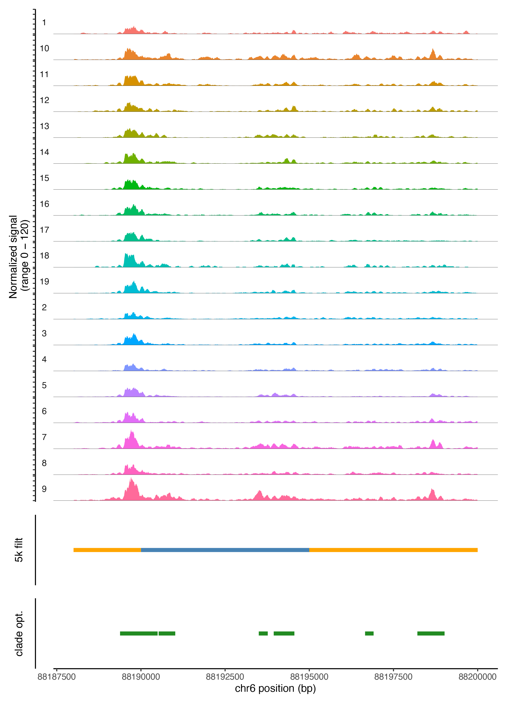
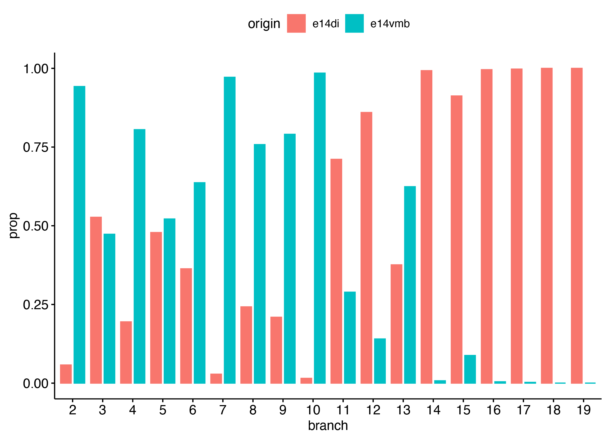
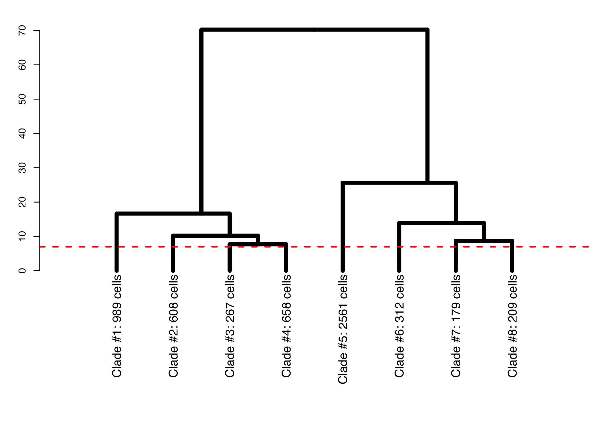
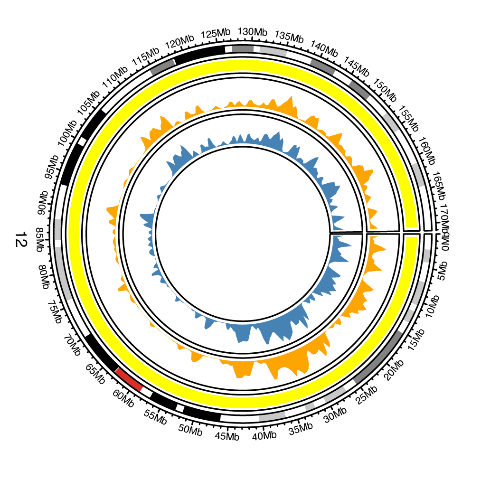
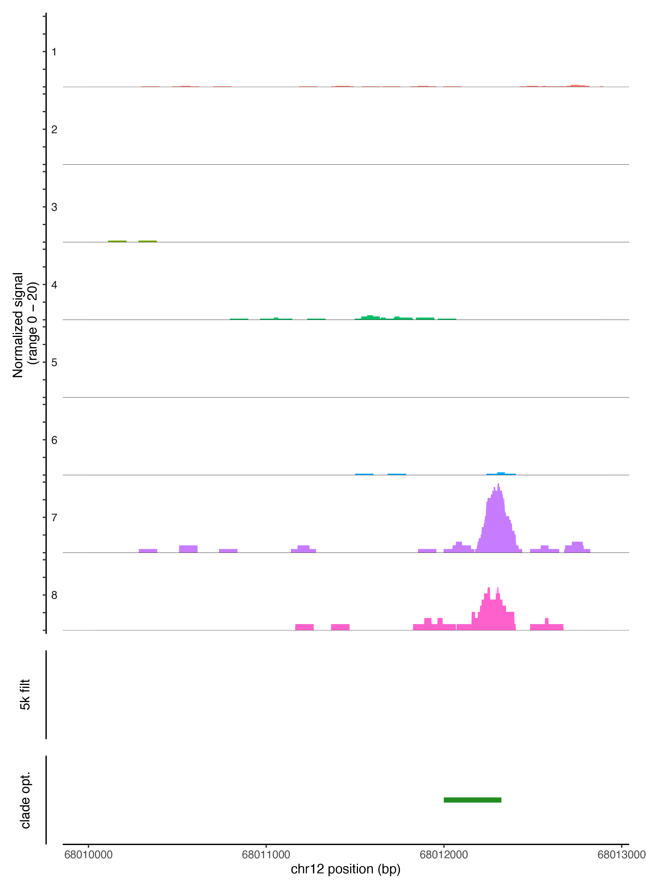

# ChromatinFeaturespace

**ChromatinFeaturespace** is an R package for defining chromatin feature spaces in single-cell ATAC-seq (scATAC-seq) data. This package enables optimized feature space definition using clade-level peak calling, improving sensitivity and resolution for rare cell populations. It integrates seamlessly with standard tools for single-cell chromatin accessibility analysis. It has been published in "An optimized method for defining the chromatin feature space in scATACseq data" application note in journal of XXX.

---

## Key Features

- **Clade-Level Peak Calling**: Dynamically define features for individual cell clades to capture rare chromatin accessibility patterns.
- **Enhanced Sensitivity**: Retains resolution and rare features missed by fixed-bin approaches.
- **Hierarchical Clustering Integration**: Utilizes Silhouette and Dunn2 indices to define optimal clade cuts in cell populations.
- **Broad Compatibility**: Supports 10x Genomics scATAC-seq outputs and other formats, enhancing workflows in tools like Signac.

---

## Installation

Install the package directly from the GitLab repository:

```r
# Install devtools if not already installed
if (!requireNamespace("devtools", quietly = TRUE)) {
    install.packages("devtools")
}

# Install ChromatinFeaturespace
devtools::install_git("https://version.helsinki.fi/kilpinen/chromatinfeaturespace")

Please note, through Signac code rely on Macs2 algorithm which to our knowledge do not have working Windows implementation.
Therefore, this package works only in MacOS and Linux environments.
```

## Example 01

Code as in /examples/Example_01.R, below are plots produced during the processing:
Example 01 files can be downloaded as tar archive <br>
wget http://tegex.helsinki.fi/chromatin_featurespace/example_01.tar <br>






## Example 02

Code as in /examples/Example_02.R, below are plots produced during the processing:
Data used in this example are from 10x webpage <br>
wget https://cf.10xgenomics.com/samples/cell-atac/1.0.1/atac_v1_pbmc_10k/atac_v1_pbmc_10k_singlecell.csv <br>
wget https://cf.10xgenomics.com/samples/cell-atac/1.0.1/atac_v1_pbmc_10k/atac_v1_pbmc_10k_fragments.tsv.gz <br>
wget https://cf.10xgenomics.com/samples/cell-atac/1.0.1/atac_v1_pbmc_10k/atac_v1_pbmc_10k_fragments.tsv.gz.tbi <br>






## License
This work is distributed under MIT License.
